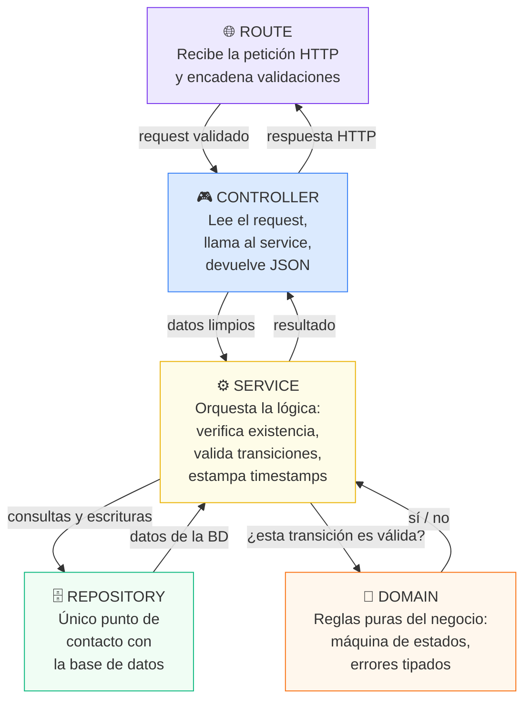
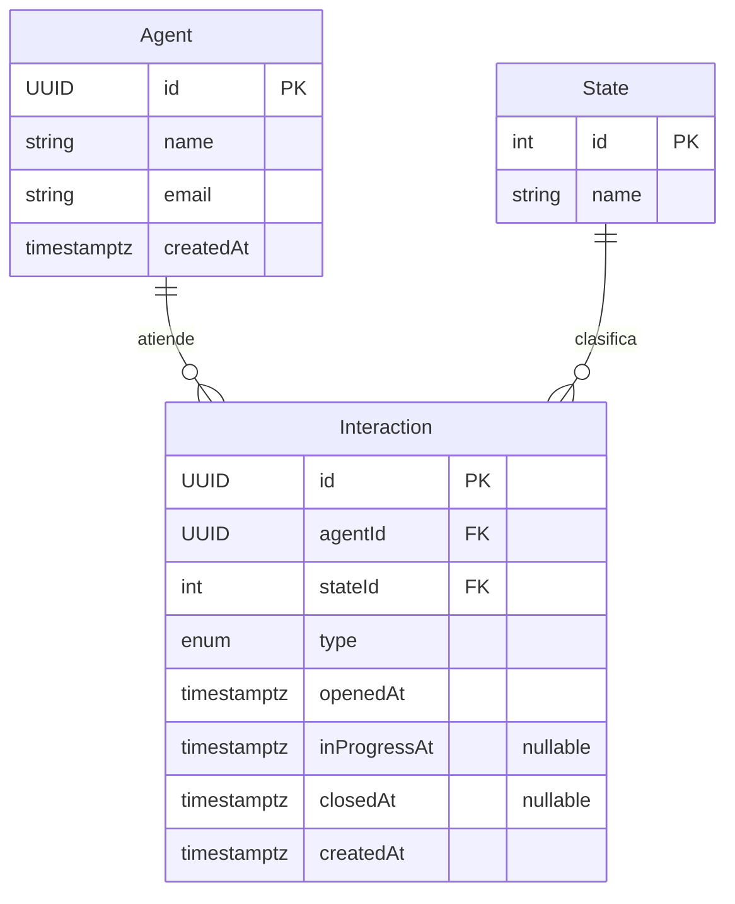
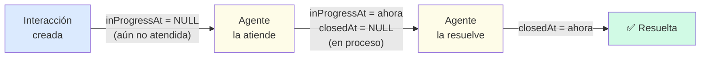
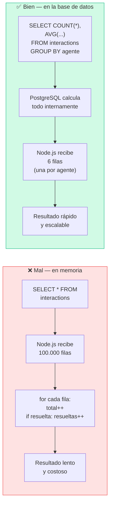
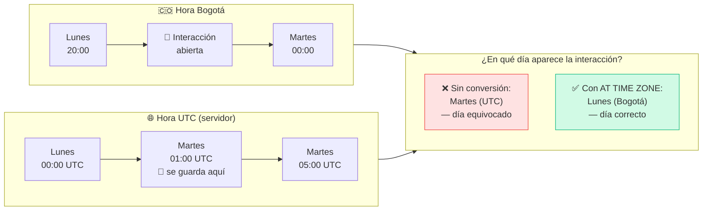
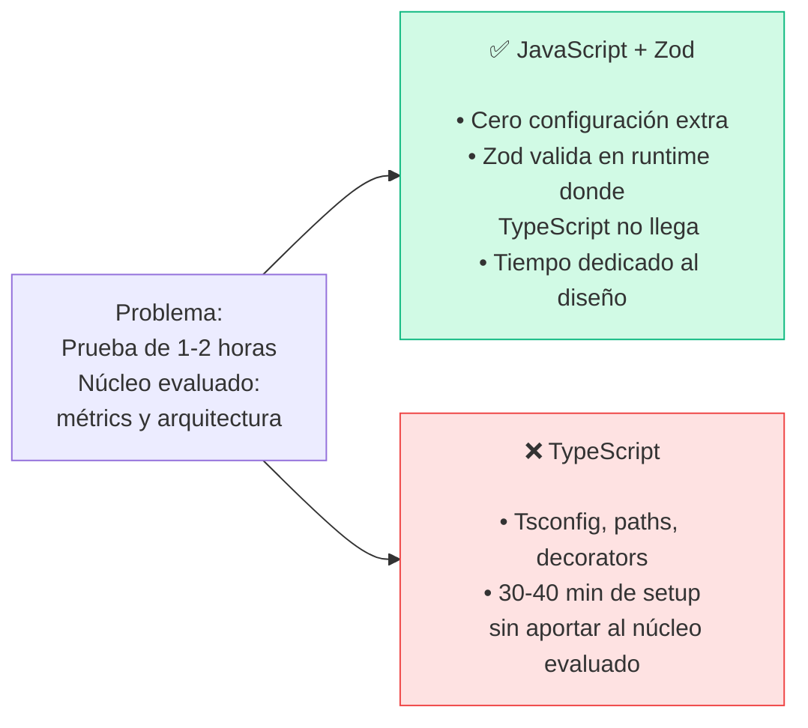
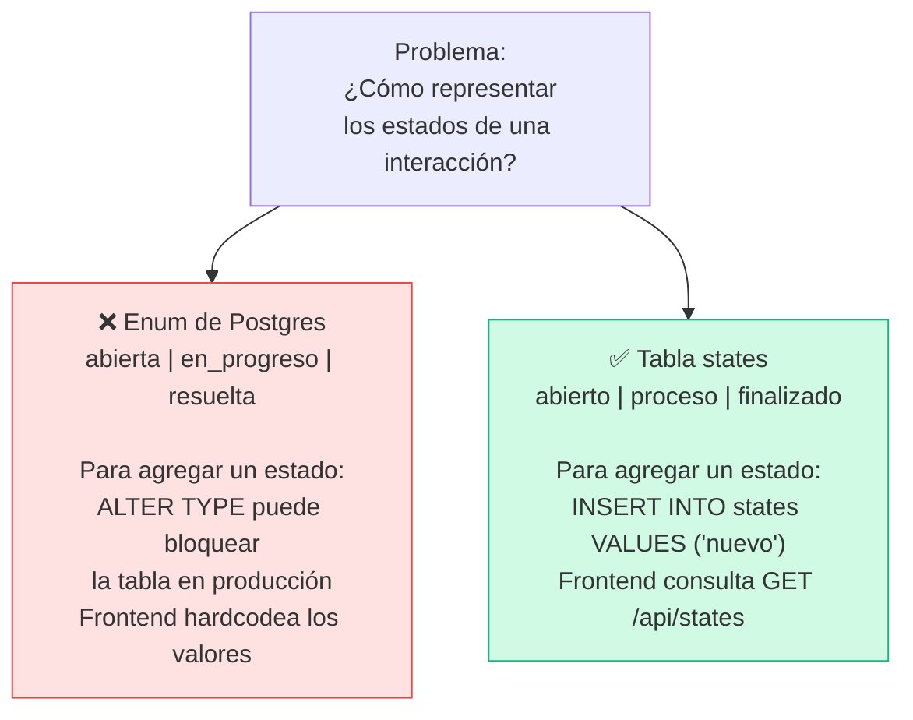
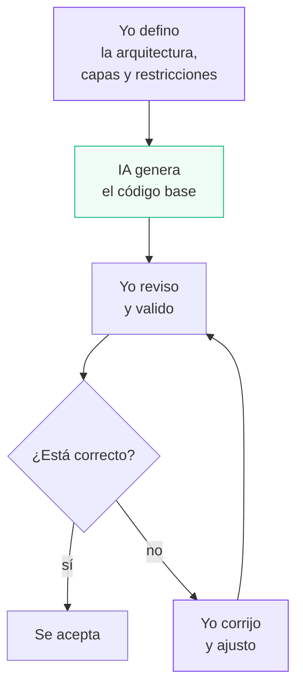

# DECISIONS.md — Engage 360 API

---

## 1. Arquitectura general

### El problema que había que resolver

Cuando un sistema crece, el código se vuelve difícil de cambiar porque todo está mezclado: la lógica de negocio vive en los mismos archivos que la lógica HTTP, que a su vez llama directamente a la base de datos. Cambiar una cosa rompe otra.

La pregunta que guió el diseño fue: **¿cómo organizar el código para que cada parte se pueda cambiar sin tocar las demás?**

### La solución: capas con responsabilidades únicas

Cada capa tiene una sola responsabilidad y una restricción explícita de lo que **no puede hacer**:



### Por qué es importante esta separación

Imagina que mañana el equipo de WeKall decide cambiar Express por otro framework, o que los cambios de estado también llegan por una cola de mensajes (no solo por HTTP). Con esta arquitectura:

- **Si cambia el framework HTTP** → solo se modifica la capa Route y Controller. La lógica de negocio no se toca.
- **Si llegan cambios de estado por una cola** → se llama directamente al Service. Las reglas del negocio aplican igual.
- **Si se cambia la base de datos** → solo cambia el Repository. El resto del sistema no lo sabe.

### Dónde vive la lógica de negocio

La regla más importante fue: **la lógica de negocio no puede vivir en el Controller ni en el Repository.**

El Controller es solo un traductor: convierte HTTP en datos y datos en HTTP. El Repository es solo un comunicador: habla con la base de datos. La lógica de negocio vive en el Service y el Domain.

Un ejemplo concreto: cuando una interacción pasa a `finalizado`, el servidor estampa automáticamente la hora de cierre (`closedAt`). **El cliente nunca envía este valor.** Si pudiera enviarlo, podría falsificar el tiempo que tardó en resolver una interacción y manipular las métricas de productividad del equipo.

---

## 2. Modelo de datos

### El problema que había que resolver

El enunciado pedía métricas de operación: ¿cuántas interacciones resolvió cada agente? ¿cuánto tiempo tardaron? ¿cómo fue el volumen por día? Un modelo de datos mal diseñado hace que estas consultas sean lentas, incorrectas o imposibles.

La pregunta guía fue: **¿cómo guardar los datos para que las consultas de métricas sean simples y correctas?**

### Las entidades y sus relaciones



### Decisiones que facilitan las métricas

**Los campos `nullable` son semántica, no ausencia de datos:**



Con estos tres timestamps puedo calcular dos tiempos distintos directamente en la base de datos:
- **Tiempo de espera:** `inProgressAt - openedAt` (cuánto esperó el cliente)
- **Tiempo de resolución:** `closedAt - openedAt` (cuánto tardó en total)

**Los estados como tabla, no como enum de la base de datos:**

| Opción | Agregar un estado nuevo | Riesgo en producción |
|---|---|---|
| Enum de Postgres (descartado) | Requiere `ALTER TYPE` — puede bloquear la tabla | Alto |
| **Tabla `states` (elegido)** | Un simple `INSERT` | Ninguno |

Además, con una tabla el frontend puede consultar `GET /api/states` y nunca tiene los estados escritos a mano en el código. Si mañana se agrega un estado nuevo, el frontend lo muestra automáticamente.

**Por qué UUID y no números (1, 2, 3...):**

Un ID numérico expone información interna: si una interacción tiene `id: 1042`, cualquiera sabe que existen al menos 1042 registros. Un UUID como `a3f8c2d1-...` no revela nada. Además, si el sistema escala a múltiples servidores, dos servidores pueden generar UUIDs simultáneamente sin coordinarse — con números, habría colisiones.

---

## 3. El endpoint de métricas

### El problema que había que resolver

Había dos trampas técnicas que la prueba mencionó explícitamente como diferencia entre una solución sólida y una frágil:

1. **No traer todas las filas a memoria para sumar en un `for`** — con miles de interacciones, esto agota la memoria del servidor.
2. **El agrupamiento por día debe respetar la zona horaria de Colombia (UTC-5)**, no la del servidor.

### Trampa 1: ¿Dónde ocurre el cálculo?



La regla fue clara desde el inicio: **las métricas se calculan en la base de datos, nunca en memoria.**

### Trampa 2: el problema de la zona horaria

Esta fue la decisión técnica más delicada. Una interacción abierta a las **8 p.m. en Bogotá** se guarda en la base de datos como la **1 a.m. UTC del día siguiente** (Colombia está 5 horas detrás de UTC).



La solución fue convertir la hora a Colombia **antes** de agrupar por día:

```sql
-- ❌ MAL: trunca en UTC → interacción aparece en martes
date_trunc('day', opened_at)

-- ✅ BIEN: convierte a Bogotá primero → interacción aparece en lunes
date_trunc('day', opened_at AT TIME ZONE 'America/Bogota')::date
```

El orden importa: `AT TIME ZONE` va **antes** de `date_trunc`.

### Cómo se verificó

El seed de datos carga deliberadamente ~140 interacciones entre las 7 p.m. y las 11:59 p.m. hora Cali. Si la conversión falla, esas interacciones aparecen en el día UTC equivocado y los totales diarios cambian visiblemente. Es una prueba de integración gratuita: los datos del seed exigen que la query esté bien.

### Las dos métricas en paralelo

El endpoint necesita dos cálculos independientes: métricas por agente y volumen por día. Ejecutarlos en secuencia haría esperar al segundo sin razón:

```mermaid
gantt
    title Tiempo de respuesta del endpoint /metrics
    dateFormat X
    axisFormat %s s

    section ❌ En secuencia
    metricasPorAgente   : 0, 3
    volumenPorDia       : 3, 6
    Total = 6s          : milestone, 6, 6

    section ✅ En paralelo (Promise.all)
    metricasPorAgente   : 0, 3
    volumenPorDia       : 0, 4
    Total = 4s          : milestone, 4, 4
```



Con `Promise.all` el tiempo total es el de la consulta más lenta, no la suma de las dos.

---

## 4. Trade-offs

Estas son las decisiones donde se eligió una opción sabiendo que tenía un costo.

### JavaScript puro vs TypeScript



**Costo asumido:** sin detección de errores de tipo en tiempo de compilación para el código interno. En producción con equipo, TypeScript sería la elección correcta.

### Tabla `states` vs enum de Postgres



**Costo asumido:** al migrar de enum a tabla con 356 filas existentes, Prisma no pudo auto-generar la migración. Tuve que escribirla manualmente con el orden correcto de pasos.

### Sin autenticación

Se asumió que el sistema opera en una red interna o detrás de un API Gateway que ya autentica. Agregar JWT habría consumido tiempo sin aportar a los criterios evaluados. Esta decisión se documenta explícitamente — el enunciado dice que decidir sobre ambigüedades con criterio también es parte de lo que se evalúa.

---

## 5. Uso de IA

Usé **Claude Code** (CLI de Anthropic) como asistente durante el desarrollo. El enunciado pide honestidad sobre este punto porque lo que se evalúa no es si se usó IA, sino el criterio detrás de las decisiones.

### Cómo fue el flujo de trabajo real



**Las decisiones de diseño fueron mías. La IA aceleró la escritura del código.**

### Qué estuvo mal y qué corregí

| Lo que entregó la IA | El problema | Lo que corregí |
|---|---|---|
| Query con `timestamp` sin zona | El error es silencioso: compila y retorna datos incorrectos. Una interacción de las 22:44 Cali aparecía en el día UTC equivocado | Cambié a `timestamptz` y validé el resultado con datos reales del seed |
| Migración automática para tabla `states` | Falló: hay 356 filas y no se puede agregar una columna NOT NULL sin datos para llenarla | Escribí la migración manual en el orden correcto: crear tabla → insertar estados → columna nullable → migrar datos → NOT NULL → eliminar enum |
| Conversión de `BigInt` en el Repository | El Repository no debe tomar decisiones de serialización | Moví la conversión al Service, que es la capa que compone la respuesta |
| `closedAt` calculado en el Controller | El cliente podría falsificar el tiempo de cierre | Lo moví al Service — solo el servidor estampa este valor |

---

## 6. Qué haría distinto con más tiempo o en producción

```mermaid
flowchart LR
    subgraph HOY ["Lo que se entregó"]
        A1["✅ Arquitectura en capas"]
        A2["✅ Métricas correctas\ncon zona horaria"]
        A3["✅ Máquina de estados"]
        A4["✅ Validación de entrada"]
        A5["✅ Seed con caso\nde medianoche"]
    end

    subgraph PROD ["Con más tiempo / en producción"]
        B1["🔐 Autenticación JWT\nCada agente ve\nsolo sus datos"]
        B2["🗑️ Soft delete\nNo borrar filas,\nmarcar con deletedAt"]
        B3["⚡ Cache de métricas\nDías pasados son\ninmutables — cachear"]
        B4["📊 Tests de integración\nVerificar el caso de\nmedianoche con Supertest"]
        B5["📝 Logging estructurado\nCorrelación de requests,\nexportación a Datadog"]
    end

    HOY --> PROD

    style HOY fill:#d1fae5,stroke:#10b981
    style PROD fill:#dbeafe,stroke:#3b82f6
```



El alcance fue acotado conscientemente. El enunciado dice: *"un proyecto pequeño bien resuelto supera a uno grande a medias."* Las funciones no implementadas no son omisiones por desconocimiento — son prioridades que se sacrificaron para que el núcleo (métricas correctas, arquitectura clara) quedara bien resuelto.
